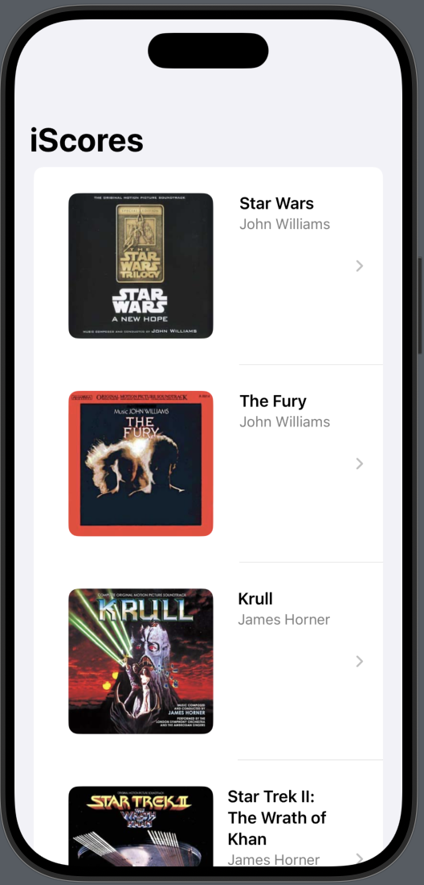

# 🎵 iScores  

**iScores** es una aplicación desarrollada en **SwiftUI** para gestionar bandas sonoras de películas de forma sencilla y moderna. Permite visualizar y editar información relacionada con las bandas sonoras, incluyendo detalles del compositor, portada y pistas.

---

## 📸 Preview

  
  

---

## 📱 Características principales

- **Listado de Bandas Sonoras**  
  Muestra todas las bandas sonoras registradas en la aplicación en una lista interactiva.  

- **Detalle de Banda Sonora**  
  Al seleccionar una película, se accede a una pantalla de detalle con:  
  - **Imagen de portada** de la banda sonora.  
  - **Foto del compositor**.  
  - **Botón Editar** para modificar los datos.  
  - **Sección Scores Data** con información detallada:  
    - `Title`: título de la película.  
    - `Composer`: nombre del compositor.  
    - `Year`: año de la película.  
    - `Length`: duración total de la banda sonora.  
  - **Sección Tracks**: lista de pistas que componen la banda sonora.  

- **Edición de Banda Sonora**  
  Al pulsar en **Edit Score**, se muestra una vista en **fullScreenCover** que permite editar:  
  - **Portada** de la banda sonora (editable y reemplazable).  
  - **Imagen del compositor**.  
  - **Nombre del compositor** mediante un **Picker**.  
  - **Datos principales**: título, año, duración.  
  - **Pistas** (Tracks) asociadas a la banda sonora.  

---

## 🛠 Tecnologías utilizadas

- **SwiftUI**: Para la creación de la interfaz gráfica.  
- **Codable + JSON**: Para la carga y decodificación de datos de bandas sonoras.  
- **FullScreenCover**: Para la pantalla de edición en modo completo.  
- **Property Wrappers de SwiftUI**: Uso de `@State`, `@Binding` y `@ObservedObject` para la gestión del estado.  

---

## 🖼 Flujo de navegación

1. **Pantalla principal** → Lista de bandas sonoras.  
2. **Seleccionar banda sonora** → Detalle con imagen, datos y tracks.  
3. **Pulsar Edit Score** → Pantalla completa para edición.  

---

## 📂 Detalles técnicos importantes

- Los datos se cargan desde un archivo **JSON local**, utilizando **Codable** para la serialización.  
- Se aprovechan las capacidades de **SwiftUI** para la actualización automática de la interfaz.  
- El diseño está adaptado para **modo claro y oscuro**.  

---

## 🚀 Próximas mejoras

- Reproducción de pistas directamente desde la app.  
- Posibilidad de añadir nuevas bandas sonoras desde cero.  
- Integración con API externas para importar bandas sonoras reales.  

---

## 📱 Requisitos

- **iOS 17.0 o superior**
- **Xcode 15 o superior**
- **Simulador o dispositivo compatible con SwiftUI**
